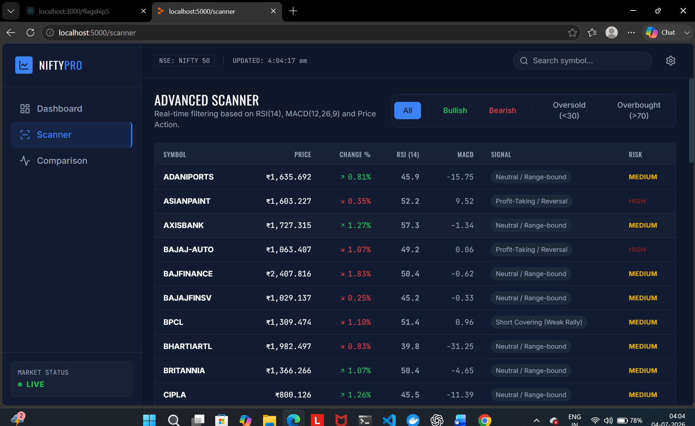
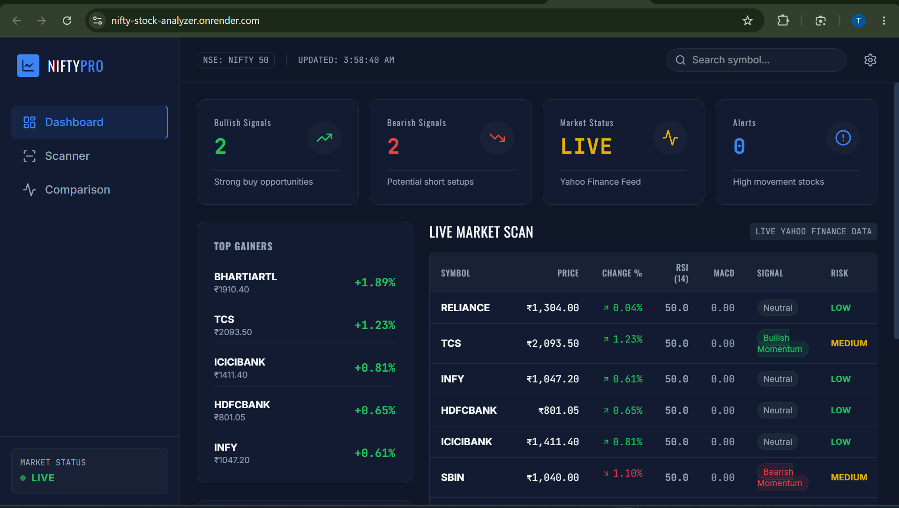

# 📈 Nifty Stock Analyzer

AI-powered stock market analytics dashboard that provides real-time stock insights, technical indicators, and trend analysis using live Yahoo Finance data.

---

## 🌐 Features

- 📊 Live Nifty stock market data
- 📈 Technical indicators (RSI, MACD, SMA)
- 🚀 Bullish/Bearish signal detection
- ⚠️ Risk analysis
- 🔄 Real-time updates
- 📱 Responsive dashboard
- 📉 Top Gainers & Top Losers

---

## 🛠 Tech Stack

- React
- TypeScript
- Node.js
- Express
- Yahoo Finance API
- Tailwind CSS
- React Query

---
## 🚀 Live Demo

🌐 **Application:** https://nifty-stock-analyzer.onrender.com

---
## 📸 Screenshots

### Dashboard



---

## ⚙️ Installation



```bash
git clone https://github.com/tanushkhare/Nifty-Stock-Analyzer.git

cd Nifty-Stock-Analyzer

npm install

npm run dev
```

---

## 📁 Project Structure

```
client/
server/
shared/
```

---

## 🚀 Future Improvements

- AI-based stock prediction
- Portfolio management
- Candlestick charts
- Watchlist
- News sentiment analysis
- Email alerts

---


## 👨‍💻 Author

**Tanush Vishal Khare**

GitHub: https://github.com/tanushkhare

LinkedIn: https://www.linkedin.com/in/tanush-khare-849167319